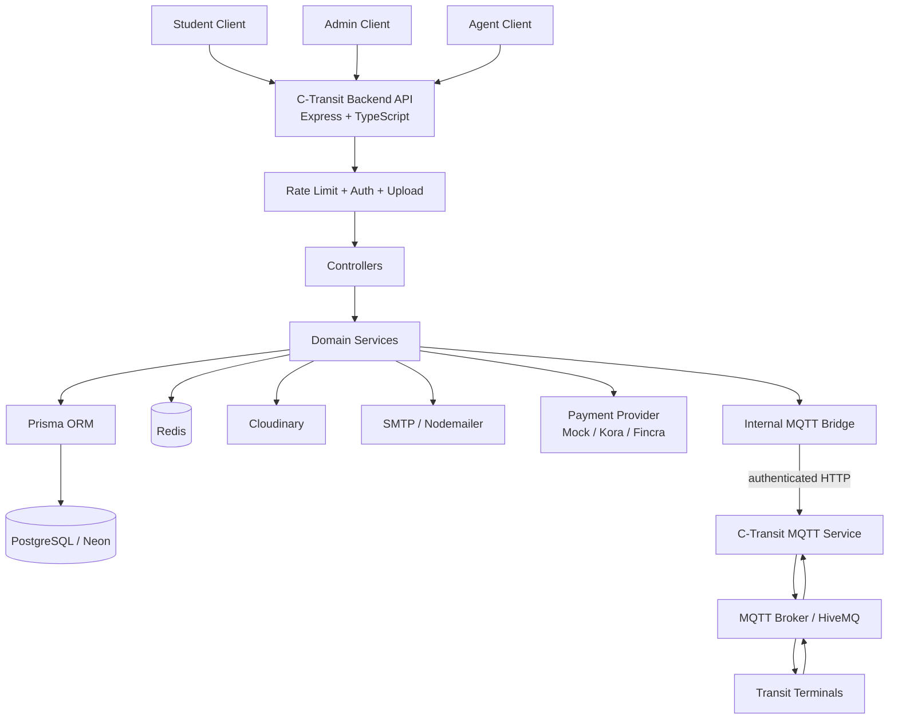
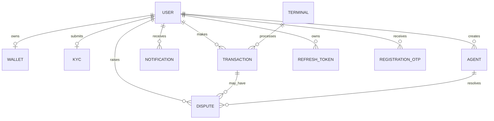
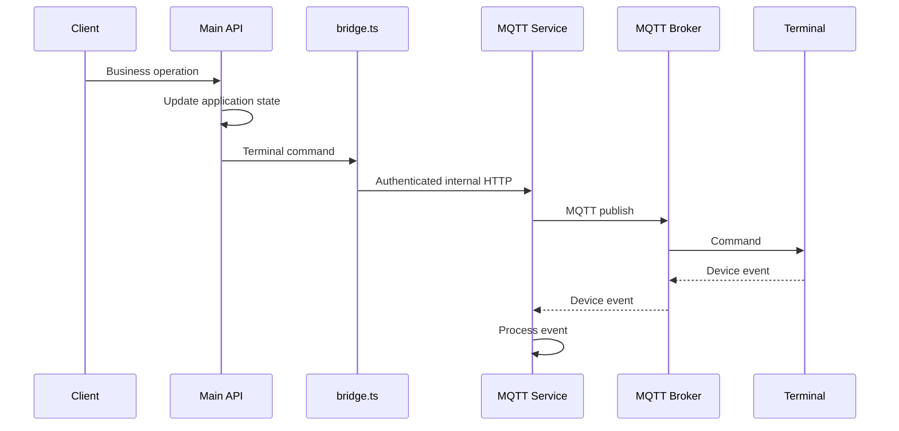
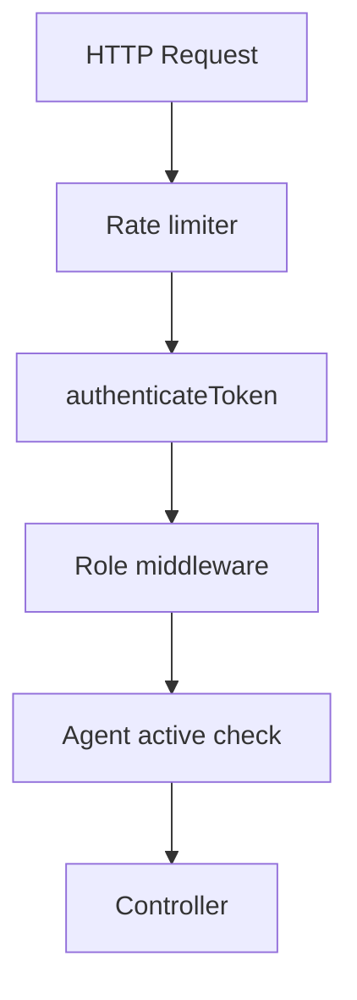

# C-Transit Backend API

The backend service for **C-Transit**, a campus transportation and wallet platform.

This repository provides the central HTTP API and business-logic layer for student accounts, authentication, KYC, wallets, transactions, payments, agents, disputes, notifications, terminal administration, and communication with the separate MQTT service.

> **Architecture note:** This repository is the **main backend/API service**. Terminal MQTT processing is handled by the separate C-Transit MQTT service. The two services communicate through the authenticated internal MQTT bridge configured with `MQTT_INTERNAL_URL` and `MQTT_INTERNAL_SECRET`.

---

## Contents

- [Architecture](#architecture)
- [Core responsibilities](#core-responsibilities)
- [Technology stack](#technology-stack)
- [Repository structure](#repository-structure)
- [Domain model](#domain-model)
- [Feature map](#feature-map)
- [Authentication and authorization](#authentication-and-authorization)
- [Database](#database)
- [Redis](#redis)
- [MQTT integration](#mqtt-integration)
- [Payments](#payments)
- [KYC and file storage](#kyc-and-file-storage)
- [Rate limiting](#rate-limiting)
- [Configuration](#configuration)
- [Local development](#local-development)
- [Database migrations](#database-migrations)
- [Production build and start](#production-build-and-start)
- [API route map](#api-route-map)
- [Operational behavior](#operational-behavior)
- [Security notes](#security-notes)
- [Performance and cost architecture](#performance-and-cost-architecture)
- [Development guidelines](#development-guidelines)

---

## Architecture



### Responsibility boundary

The main API owns:

- HTTP API and request validation
- Authentication and authorization
- User/account lifecycle
- Wallet state
- Financial ledger/business rules
- KYC state
- Disputes
- Notifications
- Agent/admin operations
- Terminal registration metadata
- Commands that need to be sent to terminals

The MQTT service owns:

- MQTT broker connectivity
- Terminal MQTT sessions
- Terminal command delivery
- Offline terminal queues
- Terminal synchronization
- MQTT transaction ingestion
- Terminal lifecycle/status events

This separation is intentional: **the API is the application/business layer; the MQTT service is the device-communication layer.**

---

# Core responsibilities

| Domain | Responsibility |
|---|---|
| Authentication | Student, admin, and agent authentication, OTP verification, refresh tokens |
| Users | Profiles, password changes, password reset, user administration |
| KYC | ID-card upload, review, approval/rejection |
| Wallets | Wallet activation, wallet details, virtual-account integration |
| Transactions | Student transaction history and financial transaction APIs |
| Payments | Top-up/payment webhooks and provider abstraction |
| Agents | Agent lifecycle, KYC review, drivers, terminals, card linking |
| Admin | Operational dashboard, terminal operations, agents, disputes, notifications |
| Terminal operations | Terminal registration, OTA, poison-pill, whitelist synchronization |
| Disputes | Student dispute creation and operational resolution |
| Notifications | Student notification feed and admin/agent notification delivery |
| MQTT bridge | Authenticated communication with the dedicated MQTT service |

---

# Technology stack

- **Node.js**
- **TypeScript**
- **Express 5**
- **PostgreSQL / Neon**
- **Prisma ORM**
- **Redis / ioredis**
- **Cloudinary**
- **Nodemailer / SMTP**
- **MQTT service integration**
- **JWT**
- **bcryptjs**
- **express-rate-limit**
- **Pino**
- **Multer**

Payment providers are abstracted behind an interface and currently include:

- `MOCK`
- `KORA`
- `FINCRA`

---

# Repository structure

```text
.
├── app.ts
├── server.ts
├── package.json
├── .env.example
│
├── prisma/
│   ├── schema.prisma
│   └── migrations/
│
└── src/
    ├── config/
    │   ├── cloudinary.ts
    │   ├── db.ts
    │   ├── env.ts
    │   ├── logger.ts
    │   └── redis.ts
    │
    ├── controller/
    ├── lib/
    ├── middleware/
    ├── payments/
    ├── routes/
    ├── services/
    └── utils/
        ├── bridge.ts
        └── parser.ts
```

### Architectural layers

```text
HTTP request
    ↓
routes
    ↓
middleware
    ↓
controllers
    ↓
services
    ↓
database / Redis / external providers
```

Controllers handle HTTP concerns. Services contain business logic.

---

# Domain model

The current Prisma schema defines:

```text
User
Wallet
Terminal
Transaction
Kyc
Blacklist
CardMapping
Agent
Notification
Dispute
RefreshToken
RegistrationOtp
```

with enums for:

```text
Role
KycStatus
TransactionType
TerminalStatus
AgentStatus
DisputeStatus
```

Relationship overview:



PostgreSQL is the durable system of record.

---

# Feature map

## Student lifecycle

```mermaid
flowchart LR
    Register["Register"]
    OTP["Verify OTP"]
    Login["Login"]
    KYC["Submit KYC"]
    Review["Admin / Agent review"]
    Wallet["Wallet activated"]
    Account["Virtual account"]
    Topup["Top up"]
    Ride["Ride transaction"]
    Dispute["Raise dispute"]

    Register --> OTP --> Login --> KYC --> Review --> Wallet --> Account --> Topup --> Ride --> Dispute
```



### Registration

Student registration supports:

- email/domain validation
- password hashing
- OTP issuance
- OTP verification
- account verification

### Authentication

Supported flows:

- student login
- admin login
- agent login
- access-token authentication
- refresh-token validation
- logout/revocation
- password reset

Refresh tokens are persisted in PostgreSQL and support immediate revocation.

---

# KYC and wallet activation

Students submit an ID-card image through the KYC endpoint.

The backend:

1. receives the multipart upload;
2. uploads the image to Cloudinary;
3. upserts the KYC record;
4. sets the status to `PENDING`;
5. notifies the student.

Approval atomically:

- approves KYC;
- verifies the user;
- creates or activates the wallet.

Rejection records the reason and notifies the student.

---

# Wallet and payments

Wallets are associated with students using their matriculation number.

Wallet state includes:

- balance
- activation state
- virtual account number
- virtual account bank name

Payment providers are selected centrally:

```text
IPaymentGateway
       │
       ├── MockProvider
       ├── KoraProvider
       └── FincraProvider
```

Configure with:

```env
PAYMENT_PROVIDER=MOCK
```

or:

```env
PAYMENT_PROVIDER=KORA
PAYMENT_PROVIDER=FINCRA
```

Provider selection lives in:

```text
src/payments/payment.container.ts
```

---

# Transactions

Supported transaction types:

```text
RIDE
TOPUP
REFUND
```

Transactions are associated with:

- student
- terminal
- optional driver
- amount
- transaction type
- synchronization timestamp

Transaction IDs are unique.

The schema includes indexes for common student, terminal, type, and driver transaction queries.

---

# Agents

Agents are separate entities from students.

Agent states:

```text
ACTIVE
SUSPENDED
DEACTIVATED
```

Agent routes use:

```text
authenticateToken
→ requireAgent
→ checkAgentActive
```

Agent capabilities include:

- KYC review
- driver registration/listing
- terminal listing
- card linking
- student listing
- student transaction lookup

---

# Admin operations

Administrative functionality is divided into two authorization classes.

### Authenticated admin operations

- agent management
- admin overview
- income statistics
- terminal listing
- dispute management
- notification delivery
- whitelist synchronization

### Admin-secret operations

Protected by `ADMIN_API_SECRET`:

- poison-pill
- OTA broadcast
- registration confirmation
- Monnify webhook
- terminal registration
- KYC approval/rejection

Do not expose admin-secret operations to normal public clients.

---

# Terminal and MQTT architecture

The main API does not maintain terminal MQTT sessions itself.

It communicates with the separate MQTT service through:

```env
MQTT_INTERNAL_URL
MQTT_INTERNAL_SECRET
```

The bridge implementation is:

```text
src/utils/bridge.ts
```



### Boundary rule

Terminal delivery, terminal queues, MQTT sessions, and device-side synchronization belong to the MQTT service.

The main API should communicate with that service through its internal interface rather than manipulating MQTT-service internals directly.

---

# Redis

Redis is configured with:

```env
REDIS_URL
```

using:

```text
src/config/redis.ts
```

Redis is intended for low-latency/transient application state and caching.

PostgreSQL remains authoritative for durable application data including:

- users
- wallets
- transactions
- KYC
- disputes
- agents
- notifications
- refresh tokens
- registration OTP state

Do not treat Redis as the source of truth for financial state.

---

# Authentication and authorization

The backend uses layered middleware:



Routes do not necessarily use every layer.

Typical patterns:

### Student

```text
authenticateToken
→ requireStudent
→ controller
```

### Agent

```text
authenticateToken
→ requireAgent
→ checkAgentActive
→ controller
```

### Admin

```text
authenticateToken
→ requireAdmin
→ controller
```

### Admin-secret

```text
requireAdminSecret
→ controller
```

---

# Rate limiting

Global rate limiting applies to the API.

Current defaults:

| Limiter | Window | Maximum |
|---|---:|---:|
| Global | 15 min | 100 |
| Login | 15 min | 5 |
| Admin login | 15 min | 3 |
| Registration | 1 hour | 5 |
| OTP | 15 min | 3 |
| KYC submit | 1 hour | 3 |
| KYC status | 15 min | 20 |
| Transactions | 15 min | 30 |
| Wallets | 15 min | 30 |
| Disputes | 1 hour | 5 |
| Notifications | 15 min | 30 |

Configuration lives in:

```text
src/config/env.ts
```

Middleware lives in:

```text
src/middleware/rate-limit.middleware.ts
```

---

# Configuration

Copy the template:

```bash
cp .env.example .env
```

## Environment variables

```env
PORT=3000
NODE_ENV=development

DATABASE_URL=
DATABASE_URL_POOLED=

REDIS_URL=

ADMIN_API_SECRET=
JWT_SECRET=
JWT_REFRESH_SECRET=
OTP_SECRET=

ALLOWED_EMAIL_DOMAIN=

MAIL_USER=
MAIL_PASSWORD=

CLOUDINARY_CLOUD_NAME=
CLOUDINARY_API_KEY=
CLOUDINARY_API_SECRET=

PAYMENT_PROVIDER=
PAYMENT_SECRET_KEY=

MQTT_INTERNAL_URL=
MQTT_INTERNAL_SECRET=

BASE_FARE=
```

### Database URLs

For Neon/hosted PostgreSQL:

```env
DATABASE_URL_POOLED=<pooled runtime connection>
DATABASE_URL=<direct migration connection>
```

Prisma is configured to use the pooled URL at runtime and the direct URL for migrations.

---

# Local development

## Prerequisites

Install:

- Node.js
- npm
- PostgreSQL or Neon
- Redis
- the separate MQTT service if terminal functionality is required

## Install dependencies

```bash
npm install
```

The `postinstall` hook generates the Prisma client.

## Configure environment

```bash
cp .env.example .env
```

Fill in the required credentials.

## Generate Prisma client

```bash
npx prisma generate
```

## Run migrations

```bash
npx prisma migrate dev
```

## Start development

```bash
npm run dev
```

Default:

```text
http://localhost:3000
```

---

# Database migrations

Schema:

```text
prisma/schema.prisma
```

Migration history:

```text
prisma/migrations/
```

Development:

```bash
npx prisma migrate dev
```

Production:

```bash
npx prisma migrate deploy
```

Inspect the database:

```bash
npx prisma studio
```

Do not rewrite migrations that have already been applied to production. Create a new migration for schema changes.

---

# Production build and start

Build:

```bash
npm run build
```

Start:

```bash
npm start
```

The production command runs:

```text
node dist/server.js
```

The server binds to:

```text
0.0.0.0:${PORT}
```

---

# API route map

## Health

```text
/health
```

## Authentication

```text
/api/auth/register
/api/auth/verify-otp
/api/auth/resend-otp
/api/auth/login
/api/auth/logout
/api/auth/refresh
/api/auth/confirm-card
/api/auth/card-link-status
/api/auth/admin/login
/api/auth/agent/...
```

## Users

```text
/api/users/forgot-password
/api/users/reset-password
/api/users/count
/api/users
/api/users/myprofile
/api/users/update-profile
/api/users/change-password
```

## KYC

```text
/api/kyc/submit
/api/kyc/status
```

## Wallet

```text
/api/wallets/link
/api/wallets/details
```

## Payments

```text
/api/payments/...
```

Includes payment/webhook operations and authenticated top-up functionality.

## Transactions

```text
/api/transactions/history
```

## Agents

```text
/api/agents/login
/api/agents/kyc/...
/api/agents/drivers/...
/api/agents/terminals
/api/agents/card/link
/api/agents/users/...
```

## Disputes

```text
/api/disputes/...
```

## Notifications

```text
/api/notifications/...
```

## Admin

Mounted at both:

```text
/admin
/api/admin
```

Includes:

```text
/admin/agents/...
/admin/overview
/admin/income
/admin/terminals
/admin/disputes/...
/admin/notifications
/admin/sync/whitelist

/admin/kyc/approve
/admin/kyc/reject

/admin/poison-pill
/admin/ota
/admin/confirm-registration
/admin/monnify-webhook
/admin/terminal/register
```

---

# Operational behavior

## Startup

`server.ts`:

1. loads environment configuration;
2. creates the HTTP server;
3. checks Redis connectivity;
4. connects to PostgreSQL;
5. starts listening on `0.0.0.0:${PORT}`.

## Graceful shutdown

The service handles:

```text
SIGTERM
SIGINT
```

and closes:

- HTTP server
- Redis
- Prisma/PostgreSQL

before exiting.

## Error handling

The Express application has a global error handler.

Unhandled promise rejections are logged.

Uncaught exceptions trigger graceful shutdown.

---

# Logging

Logging is centralized in:

```text
src/config/logger.ts
```

HTTP requests are recorded with structured fields including:

```text
method
path
statusCode
durationMs
ip
```

Morgan is only enabled in development.

Production request logging uses the structured logger.

Prefer structured application logs over direct `console.log` calls.

---

# Security

Never commit:

```text
.env
database credentials
JWT secrets
admin secrets
MQTT secrets
Cloudinary credentials
payment credentials
mail credentials
```

Use `.env.example` as the safe configuration template.

### Internal MQTT API

The main API → MQTT service boundary is authenticated with:

```env
MQTT_INTERNAL_SECRET
```

Both services must use the same secret.

### Development-only bridge

`/test-bridge` is registered only when:

```env
NODE_ENV=development
```

It must remain unavailable in production.

---

# Performance and cost architecture

The backend has been optimized around the principle that **one logical business event should not unnecessarily become N HTTP operations**.

Preferred:

```text
Application event
      ↓
Main API
      ↓
one logical MQTT operation
      ↓
MQTT service
      ↓
controlled terminal fan-out
```

Avoid unnecessary:

```text
Main API
   ↓
N HTTP requests
   ↓
N terminal operations
```

### Database

Use the existing Prisma indexes before introducing new caching.

Important indexed patterns include:

```text
User(role, isVerified)
Wallet(is_linked)
Transaction(student_uid, synced_at)
Transaction(terminal_id, synced_at)
Transaction(type)
Transaction(driver_uid, synced_at)
Terminal(status)
Kyc(status)
Kyc(status, submittedAt)
Blacklist(blacklistedAt)
CardMapping(linkedAt)
Agent(status)
Agent(createdBy, status)
```

### Financial correctness

Do not trade correctness for throughput.

Wallet/transaction changes must preserve:

- uniqueness;
- atomicity;
- balance consistency;
- idempotency.

Do not replace financial database operations with eventually-consistent cache state.

---

# Development guidelines

Before changing a feature, trace:

```text
route
→ middleware
→ controller
→ service
→ database/external integration
```

Also identify whether the MQTT service owns part of the workflow.

This is especially important for:

```text
terminal commands
whitelist/blacklist synchronization
transactions
payments
wallet changes
```

### Keep responsibilities separated

```text
routes/
    routing + middleware composition

controller/
    HTTP request/response handling

services/
    business logic

config/
    infrastructure configuration

middleware/
    cross-cutting request behavior

payments/
    payment provider implementations

utils/
    narrowly scoped shared utilities
```

### MQTT changes

Terminal communication changes should be coordinated with the separate MQTT repository.

Do not independently change:

- command formats;
- delivery guarantees;
- terminal synchronization semantics;
- offline behavior

from this repository without validating the MQTT service.

---

# Testing checklist

## Authentication

- [ ] Student registration
- [ ] OTP verification
- [ ] Login
- [ ] Refresh token
- [ ] Logout/revocation
- [ ] Password reset

## KYC

- [ ] ID-card upload
- [ ] KYC submission
- [ ] KYC status
- [ ] Approval
- [ ] Rejection
- [ ] Wallet activation

## Wallet/payment

- [ ] Wallet details
- [ ] Wallet linking
- [ ] Virtual account
- [ ] Top-up
- [ ] Payment webhook

## Transactions

- [ ] Transaction history
- [ ] Ownership checks
- [ ] Transaction uniqueness

## Agents

- [ ] Agent login
- [ ] Suspension/deactivation
- [ ] KYC review
- [ ] Driver registration
- [ ] Terminal listing
- [ ] Card linking
- [ ] Student lookup

## Admin

- [ ] Admin authentication
- [ ] Overview
- [ ] Income
- [ ] Terminal operations
- [ ] Agent management
- [ ] Disputes
- [ ] Notifications
- [ ] Whitelist synchronization
- [ ] OTA
- [ ] Poison pill
- [ ] Terminal registration

## MQTT

- [ ] Internal authentication
- [ ] Terminal command routing
- [ ] Fleet command routing
- [ ] Offline terminal behavior
- [ ] Registration synchronization

---

# Useful commands

```bash
npm install
npm run dev
npm run build
npm run lint

npx prisma generate
npx prisma migrate dev
npx prisma migrate deploy
npx prisma studio

npm start
```

---

# Environment reference

| Variable | Purpose |
|---|---|
| `PORT` | HTTP server port |
| `NODE_ENV` | Runtime environment |
| `DATABASE_URL` | Direct PostgreSQL connection / migrations |
| `DATABASE_URL_POOLED` | Pooled PostgreSQL runtime connection |
| `REDIS_URL` | Redis connection |
| `ADMIN_API_SECRET` | Privileged admin/system operations |
| `JWT_SECRET` | Access-token signing secret |
| `JWT_REFRESH_SECRET` | Refresh-token signing secret |
| `OTP_SECRET` | OTP secret |
| `ALLOWED_EMAIL_DOMAIN` | Student email-domain restriction |
| `MAIL_USER` | SMTP account |
| `MAIL_PASSWORD` | SMTP password |
| `CLOUDINARY_CLOUD_NAME` | Cloudinary account |
| `CLOUDINARY_API_KEY` | Cloudinary API key |
| `CLOUDINARY_API_SECRET` | Cloudinary secret |
| `PAYMENT_PROVIDER` | `MOCK`, `KORA`, or `FINCRA` |
| `PAYMENT_SECRET_KEY` | Payment provider credential |
| `MQTT_INTERNAL_URL` | Internal MQTT-service HTTP URL |
| `MQTT_INTERNAL_SECRET` | Shared MQTT-service secret |
| `BASE_FARE` | Base fare configuration |

---

# Production deployment checklist

- [ ] `NODE_ENV=production`
- [ ] Strong JWT secrets configured
- [ ] Strong admin secret configured
- [ ] Strong MQTT internal secret configured
- [ ] Production Neon URLs configured
- [ ] Redis URL configured
- [ ] Cloudinary credentials configured
- [ ] SMTP credentials configured
- [ ] Correct payment provider selected
- [ ] Payment secret configured
- [ ] Prisma migrations deployed
- [ ] `/test-bridge` unavailable
- [ ] CORS origins match production clients
- [ ] MQTT service reachable from the API
- [ ] MQTT internal secret matches on both services
- [ ] Health endpoint responds
- [ ] Production logs are available
- [ ] No secrets are committed

---

# Related service

The terminal communication layer is maintained separately as the **C-Transit MQTT service**.

```text
┌─────────────────────────────┐
│      C-Transit Backend      │
│                             │
│ HTTP / Auth / DB / Business │
│ Logic / Admin / Payments    │
└──────────────┬──────────────┘
               │
        Internal HTTP
               │
               ▼
┌─────────────────────────────┐
│     C-Transit MQTT Service  │
│                             │
│ MQTT / Terminals / Queues   │
│ Sync / Device ingestion     │
└──────────────┬──────────────┘
               │
               ▼
             HiveMQ
               │
               ▼
           Terminals
```

Changes crossing this boundary should be coordinated across both repositories.

---

# Source of truth

When this README conflicts with implementation, the source code is authoritative:

1. `prisma/schema.prisma` — data model
2. `src/routes/` — API routing
3. `src/middleware/` — authorization and request controls
4. `src/controller/` — HTTP behavior
5. `src/services/` — business behavior
6. `src/payments/` — payment contracts/providers
7. `src/utils/bridge.ts` — MQTT service boundary
8. `app.ts` — application composition
9. `server.ts` — runtime/bootstrap behavior

Keep this README updated whenever a major architectural boundary, external dependency, deployment requirement, or feature changes.

---

## License

Internal C-Transit project. Distribution and licensing are governed by the project owners.
